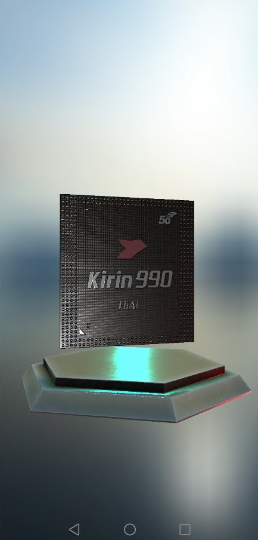

# HMS Computer Graphics Kit Demo

## Table of Contents
 * [Introduction](#introduction)
 * [Getting Started](#getting-started)
 * [Supported Environments](#supported-environments)
 * [Result](#result)
 * [License](#license)

## Introduction
CGKit sample code encapsulates APIs of the Vulkan. It provides many sample programs for your reference or usage.
The following describes heads files of sample code.

[SDK DOWNLOAD](https://developer.huawei.com/consumer/en/doc/development/HMSCore-Library/sdk-download-0000001050441521) in Software/lib

include/CGRenderingFramework/Application:    Head file of plantform apis.

include/CGRenderingFramework/Core:           Head file of instantiate apis.

include/CGRenderingFramework/Log:            Head file of log system apis.

include/CGRenderingFramework/Math:           Head file of math apis.

include/CGRenderingFramework/Rendering:      Head file of rendering apis.

include/CGRenderingFramework/Resource:       Head file of rendering resource apis.

include/CGRenderingFramework/Scene:          Head file of rendering scene apis.

libs/arm64-v8a/libcgkit.so:                  64 bit

libs/armeabi-v7a/libcgkit.so:                32 bit

## Getting Started
1. Check whether the Android studio development environment is ready. Open the sample code project directory with file "build.gradle" in Android Studio. Run TestApp on your device or simulator which have installed latest Huawei Mobile Service(HMS).
2. Register a [HUAWEI account](https://developer.huawei.com/consumer/en/).
3. Create an app, generate a signing certificate and configure the app information in AppGallery Connect.
See details: [HUAWEI CGKit Development Preparation](https://developer.huawei.com/consumer/en/doc/development/HMSCore-Guides/environment-req-0000001050200019)
4. To build this demo, please first import the demo in the Android Studio (3.5+).
5. Configure the sample code:

(1) Change the value of applicationid in the app-level build.gradle file of the sample project to the package name of your app.

(2) Add signing certificate(.jks) to the root directory, and change the value of signingConfigs in the app-level build.gradle file of the sample project.

(3) Create your own models and materials according to [CG Development Guide](https://developer.huawei.com/consumer/en/doc/development/HMSCore-Guides/demo-data-process-0000001050200023).

(4) Add include directory in SDK to your own project(src/cpp/include).
Add libs/arm64-v8a/libcgkit.so in SDK to your own project(libs/arm64-v8a).
Add libs/armeabi-v7a/libcgkit.so in SDK to your own project(libs/armeabi-v7a).
6. Run the sample on your Android device or emulator.

## Supported Environments
1. Devices with Android 10.0 or later.
2. Devices with EMUI Vulkan1.0 or Vulkan1.1.

## Result

## License
The sample of CGKit has obtained the [Apache 2.0 license.](http://www.apache.org/licenses/LICENSE-2.0).
