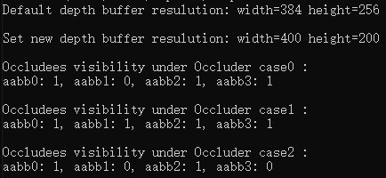

# 遮挡剔除示例代码

## 目录
 * [简介](#简介)
 * [开发准备](#开发准备)
 * [环境要求](#环境要求)
 * [运行结果](#运行结果)
 * [授权许可](#授权许可)

## 简介
遮挡剔除示例代码介绍遮挡剔除API使用方法和配置项设置。

## 开发准备
1. 下载[cgsdk-plugin](https://developer.huawei.com/consumer/en/doc/development/HMSCore-Library-V5/sdk-download-0000001050441521-V5) 将cgsdk-plugin-occlusionculling目录解压到sample目录下。

2. 编译demo

    在sample目录下执行`ndk-build NDK_PROJECT_PATH=.NDK_APPLICATION_MK=Application.mk APP_BUILD_SCRIPT=Android.mk`命令。

3. 运行demo

    执行`adb push`命令，将"Sample\obj\local\arm64-v8a"文件夹下的"libpartythengine_plugin_oc.so"和"Sample"传输到设备的"/data/local/tmp"目录下。

    在shell中执行`export LD_LIBRARY_PATH=/data/local/tmp`命令。

    在"/data/local/tmp"目录下执行`chmod a+x Sample`命令。

    在"/data/local/tmp"目录下执行`./Sample`命令。

## 环境要求
1. Android 7.0及以上的设备。

## 运行结果

## 授权许可
遮挡剔除示例代码已获得[Apache 2.0 license](http://www.apache.org/licenses/LICENSE-2.0)授权许可。
