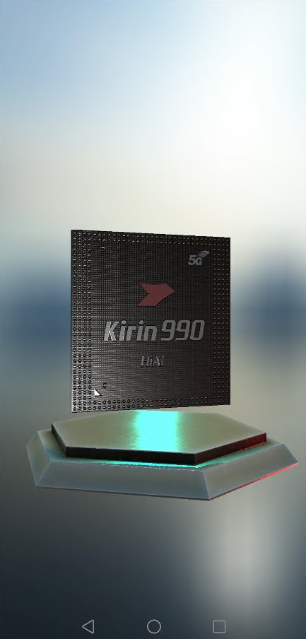

# CG Kit

## Table of Contents
 * [Introduction](#introduction)
 * [Getting Started](#getting-started)
 * [Supported Environments](#supported-environments)
 * [Result](#result)
 * [License](#license)
## Introduction
CGKit sample code encapsulates APIs of the Vulkan. It provides many sample programs for your reference or usage. 
The following describes heads files of sample code. 

([SDK DOWNLOAD](https://developer.huawei.com/consumer/en/doc/development/HMSCore-Library-V5/sdk-download-0000001050441521-V5))The path in the compressed package is: cgsdk-vulkanframework.zip/cgsdk-vulkanframework. 
cgsdk-vulkanframework headers
 File|Description
 ---|---
 include/CGRenderingFramework/Application:|Head file of platform apis.
 include/CGRenderingFramework/Core:|Head file of instantiate apis.
 include/CGRenderingFramework/Log:|Head file of log system apis.
 include/CGRenderingFramework/Math:|Head file of math apis.
 include/CGRenderingFramework/nolhmann:|Head file of json apis.
 include/CGRenderingFramework/Rendering:|Head file of rendering apis.
 include/CGRenderingFramework/Resource:|Head file of rendering resource apis.
 include/CGRenderingFramework/Scene:|Head file of rendering scene apis.
 include/CGRenderingFramework/Utils:|Head file of param apis.

 cgsdk-vulkanframework libs.
 File|Description
 ---|---
 libs/arm64-v8a/libcgkit.so:|64 bit
 libs/armeabi-v7a/libcgkit.so:|32 bit

 cgsdk-plugin base libs.
 File|Description
 ---|---
 libs/arm64-v8a/libPluginInterface.so:|64 bit
 libs/armeabi-v7a/libPluginInterface.so:|32 bit

 cgsdk-plugin other headers and libs(the path in the compressed package is:cgsdk-plugin.zip/cgsdk-plugin-offlinesuperresolution.zip/cgsdk-plugin-offlinesuperresolution/cgsdk-plugin-offlinesuperresolution/).
 File|Description
 ---|---
 pkg-for-cgsdk/include/OSRPluginCommon.h|Head file of OSRPlugin apis.
 pkg-for-cgsdk/assets/ie_data.bin|Resource file of OSRPlugin.
 pkg-for-cgsdk/assets/pluginList/plugin.json|Configuration file of OSRPlugin.
 pkg-for-cgsdk/libs/arm64-v8a/libcgkit_plugin_offlineSupRes.so|64 bit

## Getting Started
1. Check whether the Android studio development environment is ready. Open the sample code project directory with file "build.gradle" in Android Studio. Run TestApp on your device or simulator which have installed latest Huawei Mobile Service(HMS).  
2. Register a [HUAWEI account](https://developer.huawei.com/consumer/en/).  
3. Create an app, generate a signing certificate and configure the app information in AppGallery Connect. 
   See details: [HUAWEI CGKit Development Preparation](https://developer.huawei.com/consumer/en/doc/development/HMSCore-Guides/environment-req-0000001050200019)  
4. To build this demo, please first import the demo in the Android Studio (3.5+).  
5. Configure the sample code: 
 ● Change the value of applicationid in the app-level build.gradle file of the sample project to the package name of your app. 
 ● Add signing certificate(.jks) to the root directory, and change the value of signingConfigs in the app-level build.gradle file of the sample project. 
 ● Create your own models and materials according to [CG Development Guide](https://developer.huawei.com/consumer/en/doc/development/HMSCore-Guides/demo-data-process-0000001050200023). 
 ● Add Rendering Framework SDK, cgsdk-plugin-base SDK and cgsdk-plugin-offlinesuperresolution SDK to following direcotories. 
       
　　　[Rendering Framework SDK] 
　　　◉ Add include directory in SDK to your own project(src/cpp/include). 
　　　◉ Add `libs/arm64-v8a/libcgkit.so` in SDK to your own project(libs/arm64-v8a). 
　　　◉ Add `libs/armeabi-v7a/libcgkit.so` in SDK to your own project(libs/armeabi-v7a). 
       
　　　[cgsdk-plugin-base SDK] 
　　　◉ Add `libs/arm64-v8a/libPluginInterface.so` in SDK to your own project(libs/arm64-v8a). 
　　　◉ Add `libs/armeabi-v7a/libPluginInterface.so` in SDK to your own project(libs/libPluginInterface-v7a). 
       
　　　[cgsdk-plugin-offlinesuperresolution SDK] 
　　　◉ Add `pkg-for-cgsdk/include/OSRPluginCommon.h` in SDK to your own project(`src/main/cpp/include/OSRPlugin`). 
　　　◉ Add `pkg-for-cgsdk/assets/ie_data.bin` in SDK to your own project(`src/main/assets/resource`). 
　　　◉ Add pluginList directory in SDK to your own project(`src/main/assets`). 
　　　◉ Add `libs/arm64-v8a/libcgkit_plugin_offlineSupRes.so` in SDK to your own project(`OSRPlugin/arm64-v8a`).  

6. Run the sample on your Android device or emulator for vulkan rendering demo.  
7. Run the sample on your Android device or emulator for offlinesuperresolution plugin demo: 
 ● Run run.bat in app/src/main/assets/resource directory. 
 ● Dobule tap screen. 
 ● Pull the result file form `/sdcard/Android/data/com.hisi.CGRenderFrameworkDemo/output_ie_sync.ppm`. 

## Supported Environments
1. Devices with Android 8.0 or later. 
2. Devices with Vulkan1.0 or Vulkan1.1. 

## Result
 

## License
The sample of CGKit has obtained the [Apache 2.0 license](http://www.apache.org/licenses/LICENSE-2.0).
