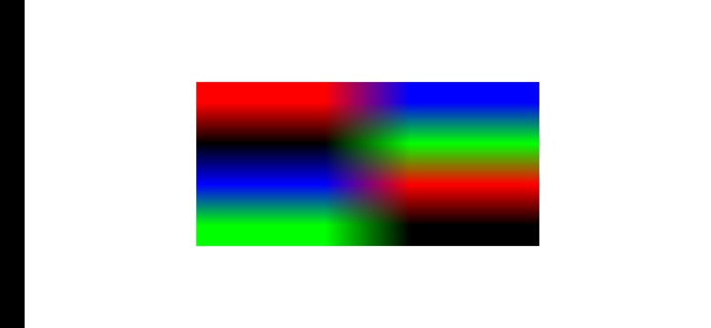

# Smart Cache（OpenGL版本）

## 目录

 * [简介](#简介)
 * [开发准备](#开发准备)
 * [环境要求](#环境要求)
 * [授权许可](#授权许可)

## 简介
本示例代码介绍OpenGL版本Smart Cache的使用方法。

主要示例接口：
1. glGetString()：查询设备是否支持OpenGL版本Smart Cache。  

2. glTexImage2D()/glTexStorage2D()：申请内存时添加Smart Cache标志。  

## 开发准备
详细步骤请参见:[业务简介](https://developer.huawei.com/consumer/en/doc/development/HMSCore-Guides/introduction-0000001050200029)
### 编译样例
编译此demo前，请先将demo导入Android Studio（3.0及以上版本）。

## 环境要求
1. 华为P40及以后机型，或Kirin 990及以上芯片平台。
2. Android 10.1及以上的设备。

## 运行结果

## 授权许可
Smart Cache（OpenGL版本）示例代码已获得 [Apache 2.0 license](http://www.apache.org/licenses/LICENSE-2.0)授权许可。
