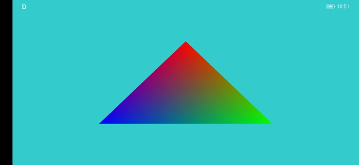

# Vulkan Smart Cache and Pre-rotation

## Table of Contents

 * [Introduction](#introduction)
 * [Preparation](#preparation)
 * [Supported Environments](#supported-environments)
 * [License](#license)

## Introduction
The sample code describes how to use Vulkan Smart Cache and Pre-rotation.

Main APIs in sample code:
1. Query supported extensions: 
vkEnumerateDeviceExtensionProperties():query if the device support Smart Cache and Pre-rotation.
2. Add extensions: 
vkCreateDevice():append the related extension to the table.

## Preparation
See details:[HUAWEI HMS Core](https://developer.huawei.com/consumer/en/doc/development/HMSCore-Guides/introduction-0000001050200029)

### Build
To build the sample, import the sample to Android Studio (3.x +).

## Supported Environments
1. Devices released after P40 or devices with more advanced chip than Kirin 990.
2. Devices with Android 10.1 or later

## Result

## License
The sample of Vulkan Smart Cache and Pre-rotation has obtained the [Apache 2.0 license.](http://www.apache.org/licenses/LICENSE-2.0).
